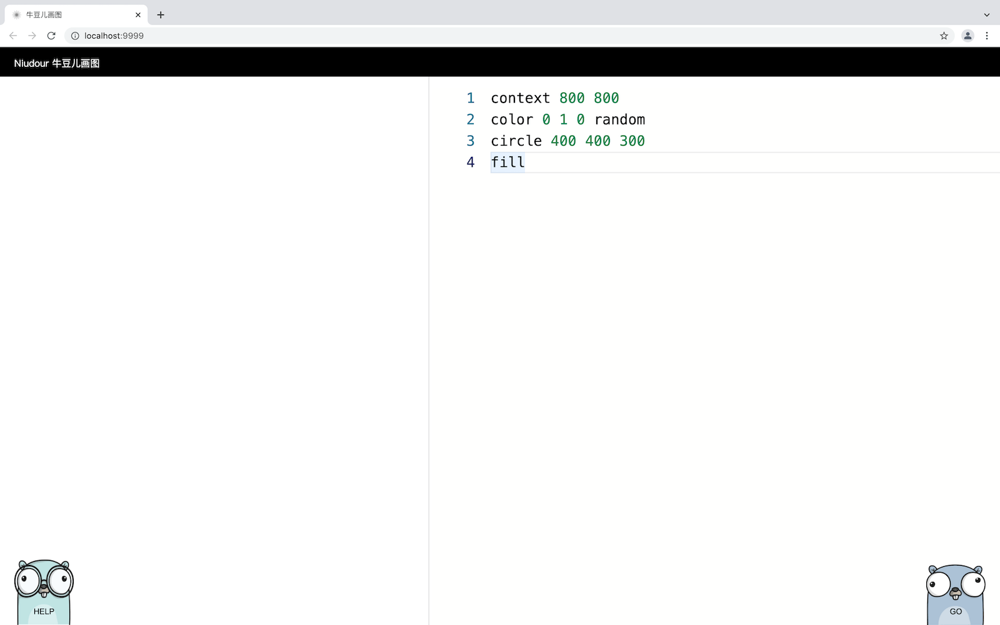
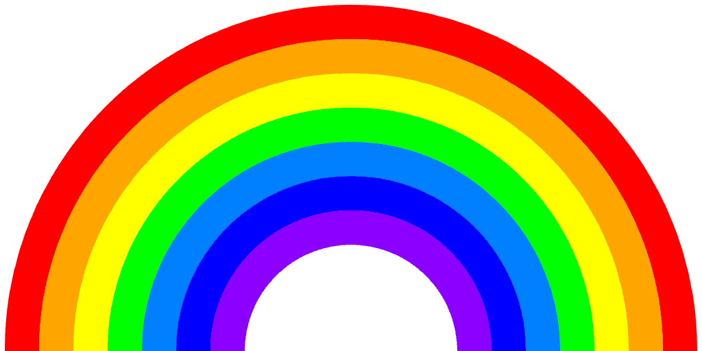
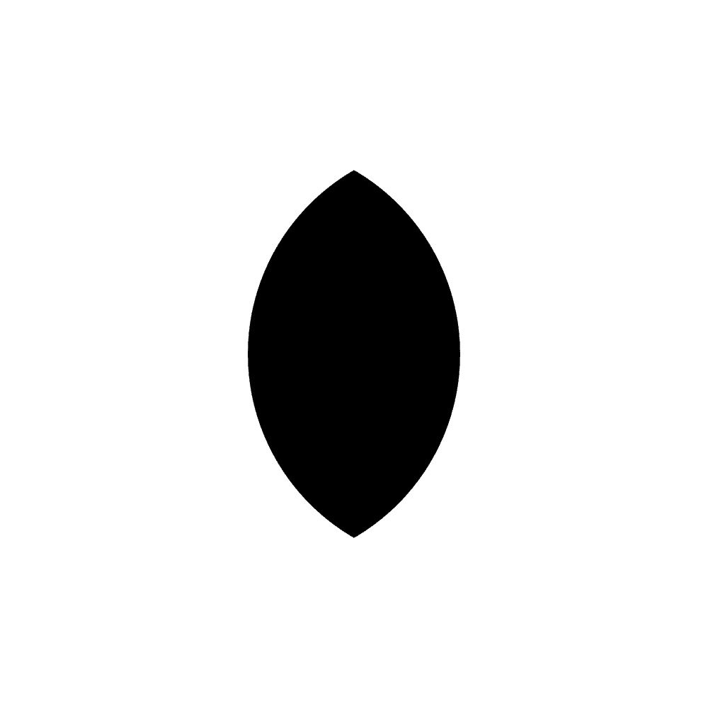
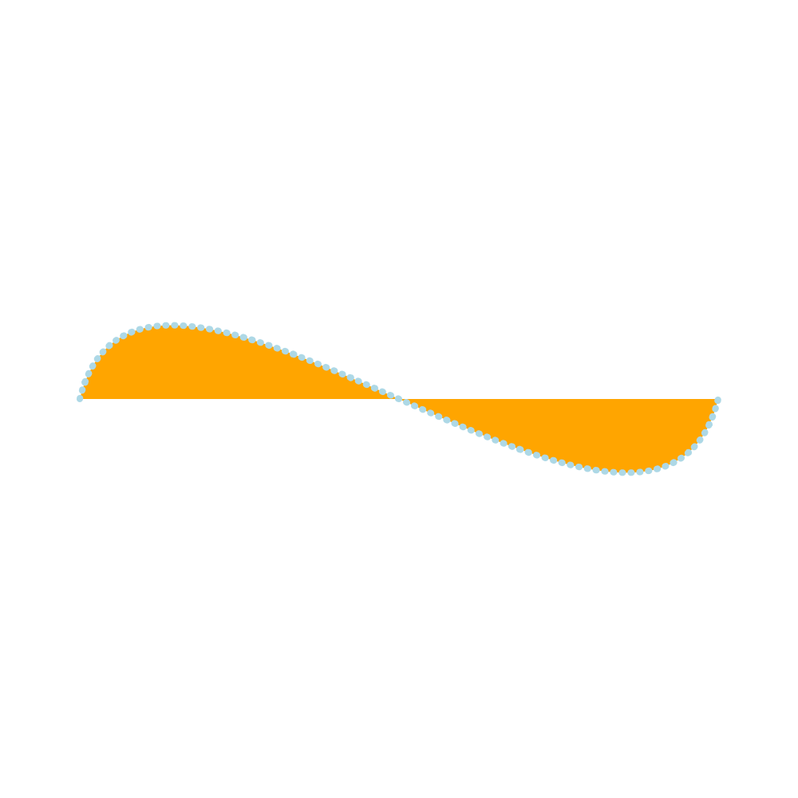
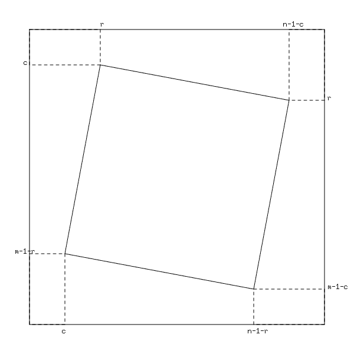

# 牛豆儿画图

## 介绍
2021辛丑牛年，即将迎来我的第一个孩子。将来可以用这个程序引导孩子编程的兴趣。

这是一个用 Go 写的趣味小项目，也不乏实用性。提供一个简单的 web 服务，支持在浏览器上用编码的形式画图。

## 体验网站
部署到了GitHub Pages，可以在这里访问： https://zrcoder.github.io/niudour

## 安装教程
如果要在本地跑，请按如下步骤操作：

1. 安装 `git` 和 `Go`
2. 下载项目
    ```
    git clone https://gitee.com/rdor/niudour
    ```
3. 运行程序
   ```
   cd niudour
   bash run.sh
   ```
4. 打开浏览器，访问 `http://localhost:9999`，开始画图之旅。

## 使用说明

我们将在一个二维坐标系里用编码的方式画图。每次输完代码，点击右下的`地鼠`按钮就会画出图形。



### 先看一个例子

```
// 1024×1024 的画布，可以不指定，默认就是绘图框的大小
context 1024 1024

// 设定当前颜色为浅绿
color lightgreen

// 定义一个圆，指定圆心和半径
circle 512 512 400

// 用当前颜色填充
fill
```

语句以行为单位，每一行都是空格隔开的内容，第一个词是操作名，之后的是操作需要的参数列表。

> "//" 开头的行是注释，会被忽略，并不参与画图。

> x 坐标从左到右，y 坐标从上到下

>  操作名、参数等支持中英两种文字。如上边画圆的代码也可以写成中文的：
>
> ```
> // 1024×1024 的画布，可以不指定，默认就是绘图框的大小
> 画布 1024 1024
> 
> // 设定当前颜色为浅绿
> 颜色 lightgreen
> 
> // 定义一个圆，指定圆心和半径
> 圆 512 512 400
> 
> // 用当前颜色填充
> 填充
> ```

## 详细教程

### 点和圆
实际上不可能画出一个点，但可以画一个小小的圆来代替，需要指定圆心和半径。
```
颜色 black
圆 50 50 2
填充
```
> English
> ```
> color black
> circle 50 50 2
> fill
> ```

### 直线
严格地说是画线段。只需指明起点和终点坐标:
```
从 10 15
到 35 50
描边
```
> English
> ```
> from 10 15
> to 35 50
> stroke
> ```

### 曲线
可以画二次或三次贝塞尔曲线。需要指明起点、中间的控制点及终点。比如：
```
从 10 15
贝塞尔 10 50 35 50
描边
```
> English
> ```
> from 10 15
> bezier 10 50 35 50
> stroke
> ```

控制点可以多加一个，成为三次贝塞尔曲线：
```
从 10 15
贝塞尔 10 40 10 60 35 50
描边
```
> English
> ```
> from 10 15
> bezier 10 40 10 60 35 50
> stroke
> ```

**练习**

可以把上边画线段和曲线的代码合在一起，实际查看绘制结果。
```
画布 100 100

从 10 15
到 35 50

从 10 15
贝塞尔 10 50 35 50

从 10 15
贝塞尔 10 40 10 60 35 50

描边
```


### 椭圆
类似圆，需要指明椭圆中心坐标、横半轴长、纵半轴长。
```
椭圆 50 50 10 20
填充
```
> English
> ```
> ellipse 50 50 10 20
> fill
> ```

### 矩形
需要指明左上角顶点以及宽和高。
```
矩形 5 5 90 40
描边
```
还可以画圆角矩形，只需要加一个参数指定圆角的半径即可：
```
矩形 5 5 90 40 10
描边
```
> English
> ```
> rectangle 5 5 90 40 10
> stroke
> ```

### 弧
另一种画曲线的方法是画一个圆弧，但要注意圆弧毕竟不同于贝塞尔曲线，其代表的曲线非常规整，不灵活。

画弧需要先指定对应圆的参数，即圆心和半径，再指定弧的起止角度（即半径旋转角度），正值为顺时针，负值为逆时针。
```
弧 50 50 40 45 180
描边
```
> English
> ```
> arc 50 50 40 45 180
> stroke
> ```

### 椭圆弧
也可以在椭圆上截取一段得到椭圆曲线。类似圆弧，先指定椭圆的参数，再指定弧的起止角度。
```
椭圆弧 50 50 40 15 0 150
描边
```
> English
> ```
> earc 50 50 40 15 0 150
> stroke
> ```

> 注意到上边的绘制动作指定为“描边”（"stroke"），你也可以改成“填充”（"fill"）看看效果，到底填充的是哪部分？

### 正多边形
祖冲之用割圆术来计算圆周率的值，就是用正多边形来模拟圆。反过来，怎么画一个正多边形？

可以先画一个圆，再把圆周均分成 n 等份，依次连接这些分割点也就形成了正n边形。

所以我们只需要指定正多边形等边数和对应外接圆等参数就可以画这个正多边形。

```
正多边形 5 50 50 40
描边
```
这样就画出了一个正五边形。
> 还可以加一个参数来旋转正多边形，一贯规范，我们约定正值为顺时针旋转，负值为逆时针旋转。
> 上边的多边形画出来后是平整地“站”在画布上，最底下的边严格平行于 x 轴。让我们来旋转它：
> ```
> 正多边形 5 50 50 40 20
> 描边
> ```
> English
> ```
> polygon 5 50 50 40 20
> stroke
> ```

### 文字

支持在图中写简单的文字，如坐标长度等，仅支持字母和数字及常见符号，不支持汉字。

需要指定文字左上角的位置和文字内容，如

```
文字 10 10 Hello!
```

> English
>
> ```
> text 10 10 Hello!
> ```

### 渲染

可以设置所有图形的线形（实线/虚线）、线宽、颜色，也可以通过旋转画布搭配载入载出的操作来旋转图形。另有裁剪等功能，你可以慢慢探索。

## API 参考

| 操作名  | 操作说明         | 参数个数 | 参数说明                          |
| ------- | ---------------- | -------- | --------------------------------- |
| 画布/context | 定义画布大小     | 2        | 画布宽和高                        |
| 矩形/rectangle | 矩形 | 4 或 5 | 左上角顶点横、纵坐标，宽、高，如果有第5个参数，会画出圆角矩形，第5个参数正是圆角的半径。 |
| 圆/circle | 圆               | 3        | 圆心横坐标、圆心纵坐标、半径      |
| 椭圆/ellipse | 椭圆 | 4 | 椭圆中心横、纵坐标，横半轴长、纵半轴长 |
| 正多边形/polygon | 正多边形 | 4或5 | 边数，外接圆圆心、半径；如果有第五个参数，则会旋转多边形，第五个参数正是要旋转的角度，正值为顺时针，负值为逆时针 |
| 从/from  | 移动画笔到指定点 | 2        | 横坐标、纵坐标                    |
| 到/to    | 连线到指定点，直线  | 2        | 终点的横坐标、纵坐标              |
| 贝塞尔/bezier | 连线到指定点，曲线 | 4 或 6 | 2 个或 3个点的横纵坐标，分别对应二次/三次贝塞尔曲线 |
| 弧/arc | 圆弧 | 5 | 前三个参数是圆心及半径，后两个参数指弧但起止角度，正值为顺时针，负值为逆时针 |
| 椭圆弧/earc | 椭圆弧 | 6 | 前四个参数是椭圆的中心及横纵半径，后两个参数指弧但起止角度，正值为顺时针，负值为逆时针 |
| 虚线/dash | 设置虚线 | 不定 | 无参数则为实线，其他参数为虚线的长度 |
| 文字/text | 文字 | >= 3 | 前两个参数是文本要添加的位置坐标，后边的内容是文本内容 |
| 颜色/color | 设置当前颜色     | 1 或 3 或 4 | 颜色名称（如"red"）或16进制表示的颜色值（如#f00, #ff00ff) 或 rgba 值，每个值在闭区间 [0, 255] 内，a默认为255，即完全不透明 |
| 填充/fill | 用当前颜色填充   | 0 或 1 | 可以加参数 preserve，填充后会保留路径。 |
| 描边/stroke | 用当前颜色描边   | 0 或 1    | 可以加参数 preserve，描边后会保留路径。 |
| 裁剪/clip | 裁剪 | 0 | |
| 清除/clear | 清除，用当前颜色填充整个画布 | 0 | |
| 线宽/lineW | 设置线宽 | 1 | 线的宽度 |
| 旋转/rotate | 绕指定点旋转 | 2 | 指定点的横、纵坐标，旋转点角度; 正值为顺时针，负值为逆时针。 |
| 载入/push   | 保存当前画布状态 | 0        |                                                           |
| 载出/pop    | 从栈中取出画布状态 | 0        |                                                           |

## 综合示例
```
context 1024 512

lineW 50

color red
arc 512 512 480 0 -180
stroke

color orange
arc 512 512 430 0 -180
stroke

color yellow
arc 512 512 380 0 -180
stroke

color green
arc 512 512 330 0 -180
stroke

color blue
arc 512 512 280 0 -180
stroke

color violet
arc 512 512 230 0 -180
stroke

color indigo
arc 512 512 180 0 -180
stroke
```



  ```
  context 1000 1000
  circle 350 500 300
  clip
  circle 650 500 300
  clip
  rectangle 0 0 1000 1000
  color black
  fill
  ```

  

```
context 1000 1000

translate 500 500
scale 40 40
from -10 0
bezier -8 -8 8 8 10 0
color orange
lineW 8
fill preserve
dash 1 10
color lightblue
stroke
```



```
context 1024 1024
color 0 0 0 25

push
ellipse 512 512 512 128
fill
pop

push
rotate 512 512 30 
ellipse 512 512 512 128
fill
pop

push
rotate 512 512 60 
ellipse 512 512 512 128
fill
pop

push
rotate 512 512 90 
ellipse 512 512 512 128
fill
pop

push
rotate 512 512 120 
ellipse 512 512 512 128
fill
pop

push
rotate 512 512 150 
ellipse 512 512 512 128
fill
pop
```


```
画布 100 100

圆 50 50 40
虚线 10
线宽 5
描边

椭圆弧 50 50 40 15 0 150
描边
```


```
context 600 600

rectangle 50 50 500 500
stroke

dash 5
rectangle 50 50 120 60
rectangle 490 50 60 120
rectangle 430 490 120 60
rectangle 50 430 60 120
stroke

color black
text 40 110 c
text 170 45 r
text 480 45 n-1-c
text 555 170 r
text 555 490 m-1-c
text 420 565 n-1-r
text 105 565 c
text 25 430 m-1-r

dash
from 170 110
to 490 170
to 430 490
to 110 430
to 170 110
stroke
```


**TODO：更多示例。**